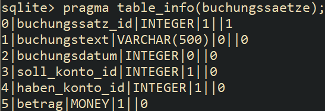
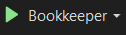
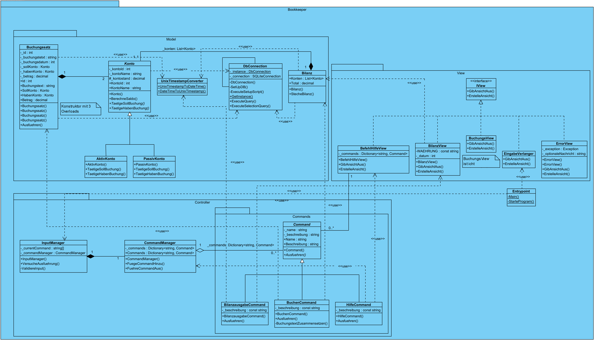
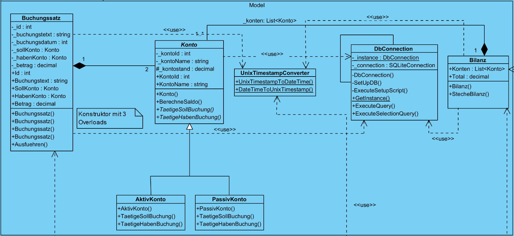
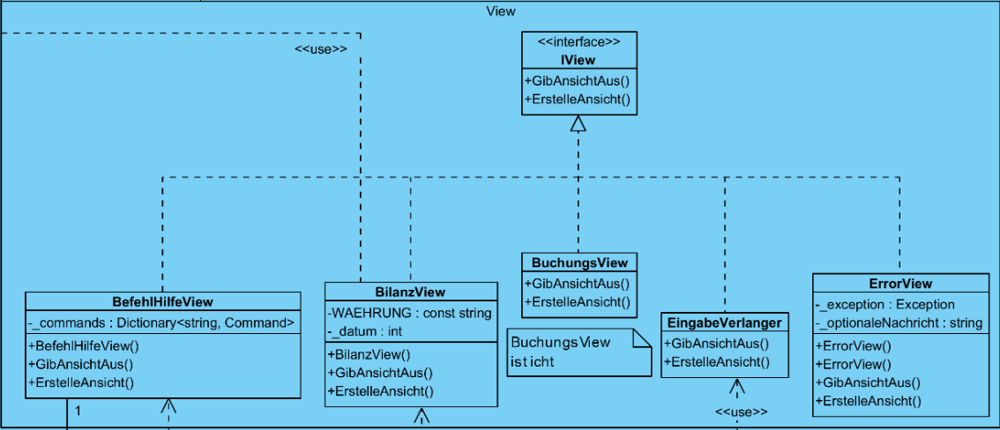
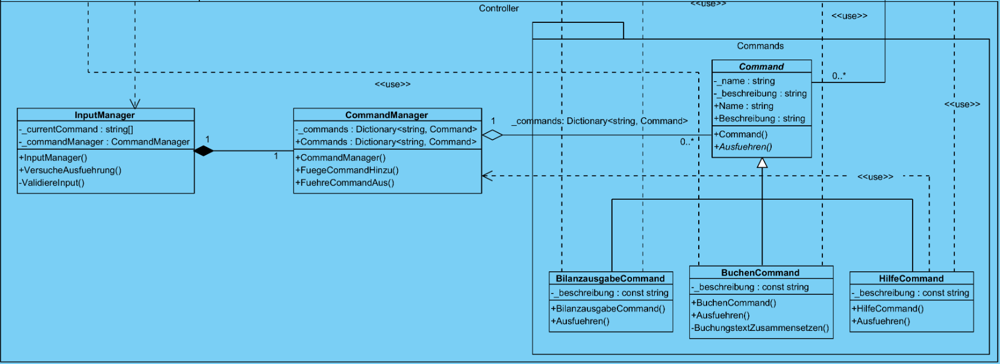

:::note

Dies ist die Dokumentation des Projekts. Sie wurde nach IPERKA umgesetzt. Es wird der Ablauf und die Vorgehensweise des ganzen Projekts dokumentiert.

In diesem Projekt erstelle ich ein eine Buchhaltungsawendung, welche einfache Buchungssätze ausführen können soll. Es geht vor allem um die objektorientierte Programmierung mit standardisierten Design Patterns.

:::

## Informieren

In diesem Kapitel der Dokumentation wird die Phase festgehalten, in welcher ich mich über alles Nötige informiere. Dazu gehören auch die Anforderungen, die Zeiteinteilung und die Auflistung [**aller verwendeten Quellen**](#quellen).

### Was versteht man unter Design Patterns?

Design Patterns sind bewährte Lösungsansätze für häufig auftretende Probleme in der Softwareentwicklung. Sie bieten Entwicklern eine strukturierte Herangehensweise zur Lösung dieser Probleme. Sie helfen bei der Entwicklung von effizienter, wartbarer und flexibler Software. Unter anderem wird auch die Wiederverwendbarkeit und Erweiterbarkeit von Code mit ihnen verbessert.

### Was ist mein Ziel?

Es ist in diesem Projekt mein Ziel, eine einfache, funktionsfähige Buchhaltungsapplikation für die Kommandozeile zu gestalten und diese dann zu implementieren.

Dabei möchte ich, wo nötig, grundlegende Design Patterns in der objektorientierten Programmierung anwenden. So soll der Code einfach Erweiterbar und wartbarer werden. Dies ist mir wichtig, da ich ggf. in zukünftigen Projekten auf diese Anwendung aufbauen möchte.

### Anforderungen

In der folgenden Tabelle sind die Anforderungen für das Projekt vorzufinden.

| Nr. | Muss/ Kann | funk./ qual./ rand | Beschreibung                                                                                        |
| ----- | ----------------- | ------------------------- | ----------------------------------------------------------------------------------------------------- |
| 1   | M               | funk.                   | Die Software muss eine Bilanz nach dem KMU-Kontenrahmen haben.                                      |
| 2   | K               | funk.                   | Die Software muss eine Erfolgsrechnung nach dem KMU-Kontenrahmen haben.                             |
| 3   | M               | funk.                   | Die Software muss Buchungssätze ausführen können und dabei die betroffenen Konten aktualisieren. |
| 4   | M               | funk.                   | Ein Buchungssatz muss Datum, Buchungstext, Soll-Konto, Haben-Konto und Betrag umfassen.             |
| 5   | M               | funk.                   | Alle gebuchten Buchungssätze müssen in einer Datenbank gespeichert werden.                        |
| 6   | M               | funk.                   | Die Bilanz muss in einer Datenbank festgehalten werden.                                             |
| 7   | M               | funk.                   | Die Software muss über die Kommandozeile bedienbar sein.                                           |
| 8   | K               | qual.                   | Es soll einen Hilfe-Befehl haben, der alle möglichen Befehle auflistet und erklärt.               |
| 9   | K               | qual.                   | Jeder Befehl soll eine Erklärung der Syntax dazu haben.                                            |
| 10  | M               | funk.                   | Es braucht einen Befehl, um Buchungssätze zu bilden.                                               |
| 11  | M               | funk.                   | Es braucht einen Befehl, um die Bilanz auszugeben.                                                  |
| 12  | K               | funk.                   | Es braucht einen Befehl, um die Erfolgsrechnung auszugeben.                                         |
| 13  | M               | rand                    | Es muss ein Klassendiagramm in UML vorhanden sein.                                                  |
| 14  | M               | rand                    | Die Software muss nach dem MVC-Konzept aufgebaut sein.                                              |
| 15  | M               | rand                    | Diese erste Version soll vollständig auf Deutsch sein.                                             |

### Technologien

Für dieses Projekt habe ich folgende Technologien verwendet:

- [.NET 6.0](https://dotnet.microsoft.com/en-us/download/dotnet/6.0)
- [C#](https://de.wikipedia.org/wiki/C-Sharp)
- [SQLite](https://sqlite.org/index.html)

### Quellen

Hier sind alle Quellen aufgelistet, welche während dem Aublauf des Projekts als Hilfe oder Orientation verwendet wurden.

- [Design Patterns](https://refactoring.guru/design-patterns)
- [SQLite offizielle Doku](https://sqlite.org/docs.html)
- [Anwendung von SQLite in einer C# App](https://www.codeguru.com/dotnet/using-sqlite-in-a-c-application/)
- [Ausführen von Scripts mit SQLite in C#](https://stackoverflow.com/questions/650098/how-to-execute-an-sql-script-file-using-c-sharp)
- [SQLite Selektionen in C#](https://alexb72.medium.com/how-to-insert-select-data-using-sqlite-in-a-c-console-application-31d5c6ba88b8)

## Planen

### Arbeitspakete

| Nr. | Frist      | Beschreibung                                                   | Geplante Zeit in Paketen |
| ----- | ------------ | :--------------------------------------------------------------- | -------------------------- |
| 1   | 28.04.2023 | Informieren (von IPERKA): vor allem über Design Patterns      | 5 (ggf. mehr)            |
| 2   | 28.04.2023 | Planen und Entscheiden (von IPERKA): Tests erstellen           | 2                        |
| 3   | 28.04.2023 | Planen und Entscheiden (von IPERKA): Klassendiagramm erstellen | 3                        |
| 4   | 12.05.2023 | Realisieren (von IPERKA): Klassen ausprogrammieren             | 10                       |
| 5   | 26.05.2023 | Kontrollieren (von IPERKA)                                     | 3                        |
| 6   | 26.05.2023 | Auswerten (von IPERKA)                                         | 2                        |
| 7   | 02.06.2023 | Portfolioeintrag bis am Abend                                  | 3 (ggf. mehr)            |

:::info

1x Arbeitspaket = 45 Minuten = 1x Schullektion

1x Halbtag = 5x Arbeitspakete

5x Halbtage = 25x Arbeitspakete

25x Arbeitspakete + 3x Portfolio = **28x Arbeitspakete**

:::

### Testfälle

| Testf. Nr. | Anf. Nr. | Voraussetzungen                                                                                        | Testumgebung    | Eingabe/Aktion                                                                    | Erw. Ausgabe                                                                                                                                                                                                                                          |
| ----------------- | --------------- | -------------------------------------------------------------------------------------------------------- | ----------------- | ----------------------------------------------------------------------------------- | ------------------------------------------------------------------------------------------------------------------------------------------------------------------------------------------------------------------------------------------------------- |
| 1.1             | 1             | Schweizer KMU-Kontenrahmen und setup.sql zur Hand nehmen.                                              | Chrome, VSC     | KMU-Bilanzkonten mit denen im Insert-Befehl im SQL-Script vergleichen.            | Alle im Kontenrahmen aufgeführten Bilanzkonten kommen im Insert-Befehl vor.                                                                                                                                                                          |
| 2.1             | 2             | Schweizer KMU-Kontenrahmen und setup.sql zur Hand nehmen.                                              | Chrome, VSC     | KMU-Erfolgskonten mit denen im Insert-Befehl im SQL-Script vergleichen.           | Alle im Kontenrahmen aufgeführten Erfolgskonten kommen im Insert-Befehl vor.                                                                                                                                                                         |
| 3.1             | 3             | Anwendung im Debugger starten                                                                          | VS              | "buche 1500 2000 5000"                                                            | "bilanz" -> Maschinen und Apparate = 5000, VLL = 5000                                                                                                                                                                                                 |
| 3.2             | 3             | 3.1 ist ausgeführt.                                                                                   | VS              | "buche 2000 1500 5000"                                                            | "bilanz" -> Maschinen und Apparate = 0, VLL = 0                                                                                                                                                                                                       |
| 4.1             | 4             | SQLite Datenbankfile öffnen (z.B. mit "sqlite3 [DB-Name]")                                            | SQLite          | "pragma table_info(buchungssaetze);"                                              |                                                                                                                                                                                                                  |
| 5.1             | 5             | SQLite Datenbankfile öffnen (z.B. mit "sqlite3 [DB-Name]"), zusätzlich sind 3.1 und 3.2 ausgeführt. | SQLite          | "SELECT * FROM buchungssaetze;"                                                   | Es sollen die Informationen zu den bei 3 verbuchten Buchungssätzen ausgegeben werden. Das Datum wird als Unix-Timestamp (einem Integer) dargestellt. Da wir keinen Text angegeben haben, soll folgendes stehen: "Kein Buchungstext wurde angegeben." |
| 6.1             | 6             | SQLite Datenbankfile öffnen (z.B. mit "sqlite3 [DB-Name]")                                            | SQLite          | ".tables"                                                                         | "bilanz_konten" muss in der Ausgabe enthalten sein.                                                                                                                                                                                                   |
| 7.1             | 7             | .sln mit Visual Studio öffnen.                                                                        | VS              | Auf diesen Knopf klicken. (Debugger starten) | Eine Linie in der Konsole wird ausgegeben  und darunter steht folgendes: "Gib einen Befehl ein:"                                                                                                                                                      |
| 8.1             | 8             | 7.1 ist ausgeführt.                                                                                   | VS              | "hilfe"                                                                           | Drei (Stand Juni, 2023) Befehle werden inkl. Beschreibung aufgelistet.                                                                                                                                                                                |
| 9.1             | 9             | 7.1 ist ausgeführt.                                                                                   | VS              | "hilfe"                                                                           | Es wird in der jeweiligen Beschreibungen auch eine Erklärung zur Syntax aufgeführt.                                                                                                                                                                 |
| 10.1            | 10            | 7.1 ist ausgeführt.                                                                                   | VS              | "hilfe"                                                                           | In der Ausgabe ist der "buche"-Befehl vorhanden.                                                                                                                                                                                                      |
| 11.1            | 11            | 7.1 ist ausgeführt.                                                                                   | VS              | "hilfe"                                                                           | In der Ausgabe ist der "bilanz"-Befehl vorhanden.                                                                                                                                                                                                     |
| 11.2            | 11            | 7.1 ist ausgeführt.                                                                                   | VS              | "bilanz"                                                                          | Alle Bilanzkonten und deren Saldo werden aufgelistet.                                                                                                                                                                                                 |
| 12.1            | 12            | 7.1 ist ausgeführt.                                                                                   | VS              | "hilfe"                                                                           | In der Ausgabe ist der "erfolg"-Befehl vorhanden.                                                                                                                                                                                                     |
| 12.2            | 12            | 7.1 ist ausgeführt.                                                                                   | VS              | "erfolg"                                                                          | Alle Erfolgskonten und deren Schlussbestand werden aufgelistet.                                                                                                                                                                                       |
| 13.1            | 13            | Die Dokumentaiton öffnen.                                                                             | Chrome          | Zur Stelle mit dem Klassendiagramm navigieren und dessen Präsenz kontrollieren.  | Das Klassendiagramm befindet sich[hier](https://mnaray.github.io/Bookkeeper_OOP/docs/Klassen).                                                                                                                                                        |
| 14.1            | 14            | Das Projekt öffnen.                                                                                   | VS              | Die Aufteilung der Klassen in die 3 Folder kontrollieren.                         | Jede Klasse befindet sich im richtigen Folder, somit auch im korrekten Namespace.                                                                                                                                                                     |
| 14.2            | 14            | 13.1 ist erfüllt.                                                                                     | Visual Paradigm | Die Verschiedenen Namespaces im Klassendiagramm kontrollieren.                    | Jede Klasse befindet sich im richtigen Namespace.                                                                                                                                                                                                     |
| 15.1            | 15            | Projekt in VS öffnen.                                                                                 | VS              | Die Klassen nach Strings durchsuchen.                                             | Jeder String mit Sprachlichem Inhalt im Projekt ist auf Deutsch.                                                                                                                                                                                      |

#### Testumgebungen

* Microsoft Visual Studio Enterprise (VS)
  * Microsoft Visual Studio Enterprise 2022
  * Version: 17.5.5
  * VisualStudio.17.Release/17.5.5+33627.172
  * Microsoft .NET Framework: 4.8.04084
  * Installed Version: Enterprise
  * C# Tools: 4.5.2-3.23171.7+d17f741546fad2786cbd6394d08619544e53a36d
  * Microsoft JVM Debugger: 1.0
  * NuGet Package Manager: 6.5.0
  * SQL Server Data Tools: 17.2.40120.0
  * SQLite & SQL Server Compact Toolbox: 4.8
  * Visual Studio IntelliCode: 2.2
* Visual Studio Code (VSC)
  * Version: 1.78.2 (user setup)
  * Commit: b3e4e68a0bc097f0ae7907b217c1119af9e03435
  * Date: 2023-05-10T14:39:26.248Z
  * Electron: 22.5.2
  * Chromium: 108.0.5359.215
  * Node.js: 16.17.1
  * V8: 10.8.168.25-electron.0
  * OS: Windows_NT x64 10.0.19045
  * Sandboxed: Yes
* SQLite
  * Version: 3.40.1
* Chrome (für PDFs und Dokumentation)
  * Version: 114.0.5735.134 (Official Build) (64-bit)
* Visual Paradigm
  * Version: 17.0

### Architektur

#### Klassendiagramm

##### Model Close-Up

##### View Close-Up

##### Controller Close-Up

:::info
Dieses Klassendiagramm wurde von Visual Paradigm 17.0 generiert und ich habe die Relationen und die Abhängigkeiten noch von Hand ergänzt. Das Bild und das .vpp-Dokument sind in [diesem Folder](https://github.com/mnaray/Bookkeeper_OOP/tree/main/VisualParadigm_diagramms) vorzufinden. *(Die Parameter für Konstruktoren und Methoden sind im Projekt sichtbar, wenn man auf diese klickt.)*
:::

#### Klassendokumentation

In der Klassendokumentation werden die Klassen aus dem Diagramm noch ein Mal genauer Dokumentiert. Es wird erklärt für was sie zuständig sind und welche Felder, Eigentschaften und Methoden sie haben.

Die Klassendokumentation ist [auf dieser Seite](Klassen.md) vorzufinden.

## Entscheiden

### Welches DBMS?

Für diesen Anwendungszweck würde sich definitiv ein SQL-DBMS eignen.
Die Software muss zur Zeit nicht gross skaliert werden, da sie lokal laufen wird. Es werden auch immer wieder dieselben Daten verwendet, zum Beispiel die Konten aus dem Kontenrahmen. Diese Werte könnten möglicherweise in eine zugewiesene Tabelle.

Es gibt auch diverse SQL-DBMS, die sicher funktionieren würden. Am geignetsten wäre aber ganz sicher [SQLite](https://sqlite.org/index.html). Dieses DBMS, weil sie mit der Software geliefert werden kann und einfach gehalten ist. Der einzige Nachteil wäre die Untauglichkeit für Multiuser-Anwendungen, dies schränkt mich hier aber nicht ein.

### Für die Zukunft oder eher nicht?

Ich stelle mir diese Frage deshalb, da ich mir etwas überlegt habe. Und zwar möchte ich dieses Projekt in potentiell zukünftigen Projekten erweitern. (Zum Beispiel mit einer Erfolgsrechnung oder einem GUI).

Und ja, ich habe entschlossen, dass ich in der Zukunft auf das Produkt von diesem Projekt aufbauen möchte. Deshalb muss ich darauf achten, dass der geschriebene Quellcode möglichst leicht erweiterbar ist. Es werden sehr warhscheinlich trotzdem noch Refactorings gebrauch werden, aber ich möchte den zeitlichen Aufwand so tief wie möglich halten.

## Realisieren

### Hilfestellung

Um dieses Projekt zu realisieren habe ich [diese Quellen](#quellen) zu meiner Hilfe genommen.
Manchmal bin ich auch zu der betreuenden Lehrperson im Lernatelier (Michael Schneider) für Ratschlag oder eine zweite Meinung gegangen.
So konnte ich schlussendlich alle Hürden, die während der Implementation aufgetreten sind, überwinden.

### Was wurde realisiert?

Die Anwendung ist eine Buchhaltungsapplikation, die über die Kommandozeile funktioniert. Ich habe Funktionen und Features gemäss [den Anforderungen](#anforderungen) implementiert. Was dort nicht als Muss-Anforderung aufgelistet ist, wurde auch nicht zwingend implementiert.

### Vorgehen bei der Realisierung

Da diese Anwendung aus einer guten Handvoll an Klassen besteht, habe ich mich dafür entschieden [das MVC-Konzept](https://de.wikipedia.org/wiki/Model_View_Controller) anzuwenden. Die Klassen sind so nach Typ der Verantwortlichkeit aufgeteilt. *(Businesslogik, Ansicht und Darstellung, Kontrolle)*

Dazu habe ich versucht den Code so erweiterbar wie möglich zu gestalten. Ich möchte nämlich in naher Zukunft diese Anwendung als Grundlage für andere Projekte oder Erweiterungen verwenden. So ist es zum Beispiel sehr einfach neue Befehle oder Kontotypen einzubauen.

### Ausführung

| Nr. | Frist      | Bemerkung                                                                                                                                                                                                                                                                                                | Zeit geplant | Zeit effektiv |
| ----- | ------------ | ---------------------------------------------------------------------------------------------------------------------------------------------------------------------------------------------------------------------------------------------------------------------------------------------------------- | -------------- | --------------- |
| 1   | 28.04.2023 | Zusätzlich in SQLite eingearbeitet.                                                                                                                                                                                                                                                                     | 5            | 8             |
| 2   | 28.04.2023 | Die Testfälle brauchten keine 90 Minuten.                                                                                                                                                                                                                                                               | 2            | 1             |
| 3   | 28.04.2023 | Klassendiagramm hat um einiges länger gebraucht als gedacht. Ich musste doch noch meine UML-Kenntnisse ein wenig auffrischen. Somit habe ich es erst bis auf Mitte Mai fertig bekommen.                                                                                                                 | 3            | 6             |
| 4   | 12.05.2023 | Das ausprogrammieren hat auch länger gebraucht als geplant. Es haben sich ein paar unnötige Bugs in den Code geschlichen, da ich öfters müde war beim Arbeiten. Ansonsten war ich mit dem Coden zufrieden. Ich konnte aber erst Anfang Juni den Teil mit dem Programmieren volständig abschliessen. | 10           | 13            |
| 5   | 26.05.2023 | Das Kontrollieren wurde am 16.06.2023 fertiggestellt.                                                                                                                                                                                                                                                    | 3            | 2             |
| 6   | 26.05.2023 | Die Auswertung wurde auch am 16.06.2023 gemacht.                                                                                                                                                                                                                                                         | 2            | 1             |
| 7   | 02.06.2023 | Da die Anwendung simpel gehalten ist, habe ich nicht allzu viel zum Schreiben gehabt (über das Produkt). Das Portfolio besteht vor allem aus meiner Verifikation und der Reflexion.                                                                                                                     | 3            | 2             |

:::caution

Die tatsächliche Ausführung des Projekts sieht um einiges anders aus als in der Planung, da wir (die Schüler der Klasse) noch mehr Zeit bis zur Abgabe bekommen haben. Dies ist aufgrund von fehlendem Feedback so, und ohne Feedback wissen wir nicht was zu verbessern ist. Das Portfolio wird/wurde erst viel später als geplant fertiggestellt und abgegeben.

:::

## Kontrollieren

### Testprotokoll

|  Test-Nr. | Bemerkung                                                                                                                                                                                                                                                                                                                                                                                                                         | Resultat | Datum      | Visum        |
| ---------------- | ----------------------------------------------------------------------------------------------------------------------------------------------------------------------------------------------------------------------------------------------------------------------------------------------------------------------------------------------------------------------------------------------------------------------------------- | ---------- | ------------ | -------------- |
| 1.1            | Das Script ist standardmässig so konfiguriert, dass das Eigenkapital für eine Aktiengesellschaft aufgebaut ist. Die EK-Konten für andere Unternehmensstrukturen sind auskommentiert, damit keine Konflikte entstehen. Das Script ist leicht modifizierbar, indem man die nötigen Konten ent- oder auskommentiert. Manche Konten haben eine ähnliche Bezeichnung, aber eine andere Nummer. (zum Beispiel Unterkonten von 150) | OK       | 16.06.2023 | Marton Naray |
| 2.1            | Die Erfolgsrechnung ist zur Zeit noch nicht implementiert.                                                                                                                                                                                                                                                                                                                                                                        | NOK      | 16.06.2023 | Marton Naray |
| 3.1            |                                                                                                                                                                                                                                                                                                                                                                                                                                   | OK       | 16.06.2023 | Marton Naray |
| 3.2            |                                                                                                                                                                                                                                                                                                                                                                                                                                   | OK       | 16.06.2023 | Marton Naray |
| 4.1            |                                                                                                                                                                                                                                                                                                                                                                                                                                   | OK       | 16.06.2023 | Marton Naray |
| 5.1            |                                                                                                                                                                                                                                                                                                                                                                                                                                   | OK       | 16.06.2023 | Marton Naray |
| 6.1            |                                                                                                                                                                                                                                                                                                                                                                                                                                   | OK       | 16.06.2023 | Marton Naray |
| 7.1            |                                                                                                                                                                                                                                                                                                                                                                                                                                   | OK       | 16.06.2023 | Marton Naray |
| 8.1            |                                                                                                                                                                                                                                                                                                                                                                                                                                   | OK       | 16.06.2023 | Marton Naray |
| 9.1            |                                                                                                                                                                                                                                                                                                                                                                                                                                   | OK       | 16.06.2023 | Marton Naray |
| 10.1           |                                                                                                                                                                                                                                                                                                                                                                                                                                   | OK       | 16.06.2023 | Marton Naray |
| 11.1           |                                                                                                                                                                                                                                                                                                                                                                                                                                   | OK       | 16.06.2023 | Marton Naray |
| 11.2           |                                                                                                                                                                                                                                                                                                                                                                                                                                   | OK       | 16.06.2023 | Marton Naray |
| 12.1           |                                                                                                                                                                                                                                                                                                                                                                                                                                   | NOK      | 16.06.2023 | Marton Naray |
| 12.2           |                                                                                                                                                                                                                                                                                                                                                                                                                                   | NOK      | 16.06.2023 | Marton Naray |
| 13.1           |                                                                                                                                                                                                                                                                                                                                                                                                                                   | OK       | 16.06.2023 | Marton Naray |
| 14.1           |                                                                                                                                                                                                                                                                                                                                                                                                                                   | OK       | 16.06.2023 | Marton Naray |
| 14.2           |                                                                                                                                                                                                                                                                                                                                                                                                                                   | OK       | 16.06.2023 | Marton Naray |
| 15.1           |                                                                                                                                                                                                                                                                                                                                                                                                                                   | OK       | 16.06.2023 | Marton Naray |

### Testfazit

Alle Muss-Anforderungen sind erfüllt, nur eine Kann-Anforderung (Nr. 8, Hilfe-Befehl) ist erfüllt. Die Anwendung ist so, wie sie zur Zeit des Testens ist funktional und bedienbar.

## Auswerten

### Produkt

Ich habe mir [hier](#was-ist-mein-ziel) vorgenommen, dass ich eine erweiterbare Konsolenanwendung erstelle. Ich denke, dass ich dies gut erfüllen konnte. Es gibt aber definitiv noch ein paar Stellen, die ich mit strengerer Berücksichtigung von SOLID überarbeiten könnte.

### Arbeitsprozess

Während diesem Projekt habe ich viel neues gelernt und ich konnte dieses neue Wissen in manchen Fällen sogar direkt andwenden. Das hat mir sehr bei der Verfestigung des neuen Stoffes geholfen. (Learn by doing)

Ich hatte hier auch seit längerem mal wieder die Freiheit von einem Einzelprojekt. Ich konnte nach meinen Kriterien und Standards arbeiten, was vor allem die Realisierung der Anwendung erleichtert und verschnellert hat. Damit möchte ich nicht sagen, dass die Zusammenarbeit mit anderen schlecht ist, sondern dass ich andere Sachen beachten muss. Zum Beispiel werden Entscheidungsprozesse schneller und somit sind diese weniger im Zentrum. Ich kann unter Anderem auch neue Technologien erlernen, die andere nicht zwingend interessieren.

Grundsätzlich bin ich mit meinem Arbeitsprozess zufrieden, ich konnte neues lernen und meine Ziele erreichen.
